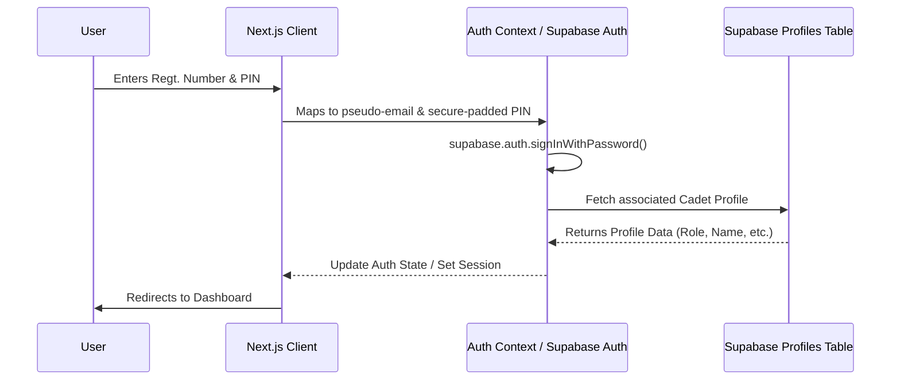
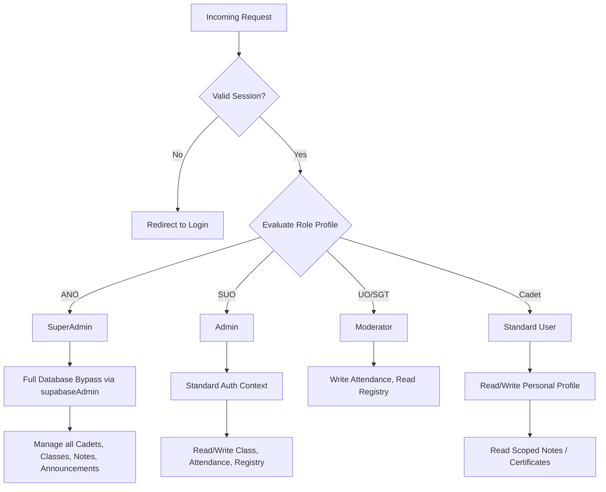
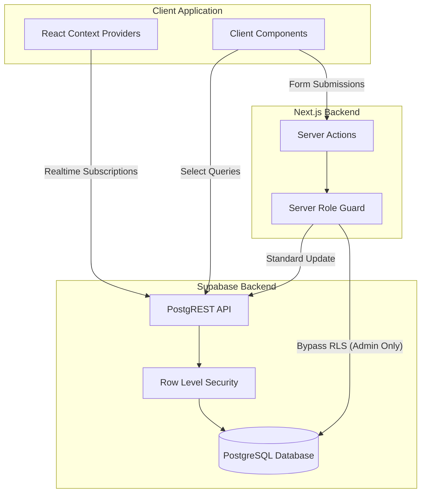
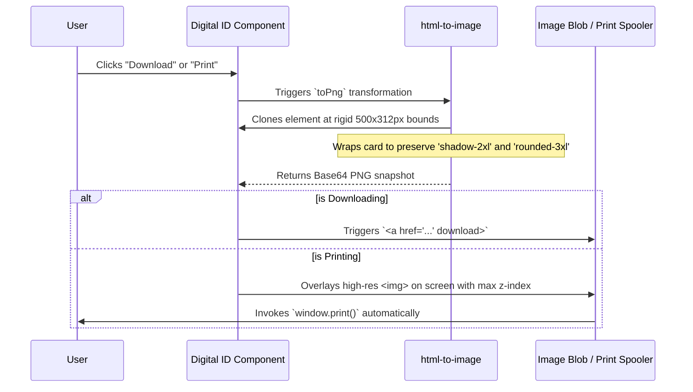
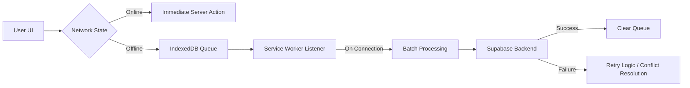

# NCC RGU System Architecture

This document provides a high-level overview of the system architecture, access control, and data flow mechanisms utilized within the NCC RGU Cadet Management System.

## Architecture Diagrams

### 1. Authentication Flow
The system maps username + PIN credentials to Supabase Auth's email/password flow, providing a seamless identity experience with standardized security.

### 2. Permission Decision Tree
Row-Level Security (RLS) and server-side logic dictate operations based on the user's role.

### 3. Data Flow Between Client & Server
We use the standard Supabase client for safe client-side reads, and Next.js Server Actions with the \`supabaseAdmin\` client for writes that need to bypass RLS.

### 4. QR Code Generation Pipeline
We use `html-to-image` to export the ID card as a PNG so it prints consistently across different mobile devices without CSS layout breaks.

### 4. Privileged Access vs Public Client
The system utilizes two distinct Supabase clients to enforce the security boundary between standard user operations and administrative tasks.

*   **Public Client (`src/lib/supabase-client.ts`)**: Used in client-side components. Every request is filtered by the user's JWT and must satisfy PostgreSQL Row Level Security (RLS) policies.
*   **Admin Client (`src/lib/supabase-admin.ts`)**: Used exclusively in Server Actions. It utilizes the `SERVICE_ROLE_KEY` to bypass RLS. This is required for operations that affect multiple users or systems where standard user credentials lack the necessary scope (e.g., bulk attendance updates by an ANO).

### 5. Offline Data Synchronization
To support environments with limited connectivity, the system implements a queue-based synchronization mechanism using a Service Worker and IndexedDB.

