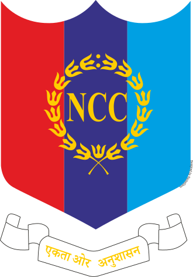

<p align="center">
  
  &nbsp;&nbsp;&nbsp;
  
</p>

<h1 align="center">NCC RGU — Cadet Management System</h1>

<p align="center">
  A comprehensive web application for the <strong>National Cadet Corps (NCC)</strong> unit at <strong>Royal Global University (RGU)</strong>, Guwahati, Assam.<br/>
  Built for ANOs, SUOs, and Cadets to manage attendance, classes, communications, and records — all in one place.
</p>

<p align="center">
  <a href="https://rgu-ncc-web-application.vercel.app">🌐 Live Demo</a>
  &nbsp;·&nbsp;
  <a href="#-features">Features</a>
  &nbsp;·&nbsp;
  <a href="#-getting-started">Getting Started</a>
  &nbsp;·&nbsp;
  <a href="#-tech-stack">Tech Stack</a>
</p>

---

## ✨ Features

| Module | Description |
|--------|-------------|
| **📊 Dashboard** | Dynamic stats (total cadets, attendance rate, active classes, unread notes), attendance chart, announcements banner, and live recent activity feed |
| **📅 Attendance** | Mark cadets as Present / Absent / Late / Excused per class. Export attendance as CSV |
| **📚 Classes** | Schedule, view, and delete training sessions with instructor assignment |
| **🎖️ Cadet Registry** | Enroll, edit, and delete cadets. Export full registry as CSV. Wing-based unit auto-fill (Army → Bn, Air → Air Sqn, Navy → Naval) |
| **💬 Private Notes** | Hierarchical messaging — Cadets ↔ SUOs ↔ ANO. Send, reply, forward to ANO, and delete notes |
| **📢 Announcements** | Post urgent or normal announcements visible to all users. ANOs and SUOs can manage posts |
| **📋 Activity Log** | ANO-only audit trail of all system actions with timeline view and action-type filtering |
| **🪪 Digital ID Card** | Profile page with downloadable NCC ID card featuring QR code for instant verification |
| **📜 Certificates** | Upload and manage NCC certificates (A/B/C/Camp/Award) per cadet |
| **📁 File Sharing** | Upload and share PDFs, images, and videos across the unit |
| **🌙 Dark Mode** | Toggle between light and dark themes with persistent preference |

## 🔐 Role-Based Access

The application supports a **three-tier hierarchy**:

| Role | Access Level |
|------|-------------|
| **ANO** (Associate NCC Officer) | Full admin — manage cadets, classes, attendance, notes, announcements, activity log |
| **SUO** (Senior Under Officer) | Manage classes, attendance, announcements. Forward notes to ANO |
| **Cadet** | View dashboard, mark attendance (when allowed), send notes, view profile & certificates |

### Demo Credentials

| Role | Username | PIN |
|------|----------|-----|
| ANO | `ANO` | `0324` |
| SUO | `Pranay Borthakur` | `2468` |
| Cadet | `Ananya Sharma` | `1234` |

## 🛠️ Tech Stack

| Layer | Technology |
|-------|-----------|
| Framework | [Next.js 16](https://nextjs.org/) (App Router, Turbopack) |
| Language | TypeScript |
| Styling | Tailwind CSS v4 |
| Icons | [Lucide React](https://lucide.dev/) |
| Animations | [Framer Motion](https://www.framer.com/motion/) |
| QR Codes | [qrcode.react](https://www.npmjs.com/package/qrcode.react) |
| ID Export | [html-to-image](https://www.npmjs.com/package/html-to-image) |
| Deployment | [Vercel](https://vercel.com/) |
| Data | Browser `localStorage` (no backend required) |

## 🚀 Getting Started

### Prerequisites

- **Node.js** 18+ 
- **Git**

### Installation

```bash
# Clone the repository
git clone https://github.com/CaptainCheetah978/RGU-NCC-Web-Application.git
cd RGU-NCC-Web-Application

# Install dependencies
npm install

# Start the development server
npm run dev
```

Open [http://localhost:3000](http://localhost:3000) in your browser.

### Production Build

```bash
npm run build
npm start
```

## 📁 Project Structure

```
src/
├── app/
│   ├── dashboard/
│   │   ├── activity/        # Activity log (ANO-only)
│   │   ├── announcements/   # Announcements page
│   │   ├── attendance/      # Attendance marking
│   │   ├── cadets/          # Cadet registry
│   │   ├── classes/         # Class management
│   │   ├── files/           # File sharing
│   │   ├── notes/           # Private notes
│   │   ├── profile/         # User profile & ID card
│   │   ├── sheet/           # Attendance sheet
│   │   ├── layout.tsx       # Dashboard shell
│   │   └── page.tsx         # Dashboard home
│   ├── verify/              # QR code verification page
│   ├── layout.tsx           # Root layout
│   ├── page.tsx             # Login page
│   └── globals.css          # Design tokens & theme
├── components/
│   ├── dashboard/           # Dashboard widgets
│   ├── profile/             # Profile components
│   ├── ui/                  # Shared UI components
│   ├── providers.tsx        # Context providers
│   ├── sidebar.tsx          # Navigation sidebar
│   └── topbar.tsx           # Top header bar
├── lib/
│   ├── auth-context.tsx     # Authentication state
│   ├── data-context.tsx     # Data management & localStorage
│   ├── theme-context.tsx    # Dark mode toggle
│   ├── mock-data.ts         # Seed users & demo data
│   └── utils.ts             # Utility functions
└── types/
    └── index.ts             # TypeScript type definitions
```

## 🌐 Deployment

The app is deployed on **Vercel** with automatic deployments on every push to `main`.

1. Push your code to GitHub
2. Import the repository on [Vercel](https://vercel.com/new)
3. Vercel auto-detects Next.js and configures the build
4. Click **Deploy** — done!

## ⚠️ Data Persistence

All data is stored in the browser's `localStorage`. This means:
- ✅ No backend or database setup required
- ✅ Instant, zero-latency operations
- ⚠️ Data is per-browser and per-device
- ⚠️ Clearing browser cache will reset all data

## 📄 License

This project is developed for the **NCC unit at Royal Global University, Guwahati, Assam**.

---

<p align="center">
  Made with ❤️ for the National Cadet Corps
</p>
