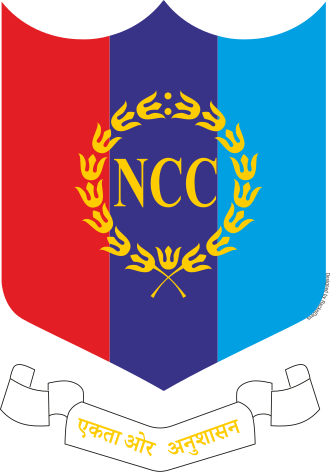
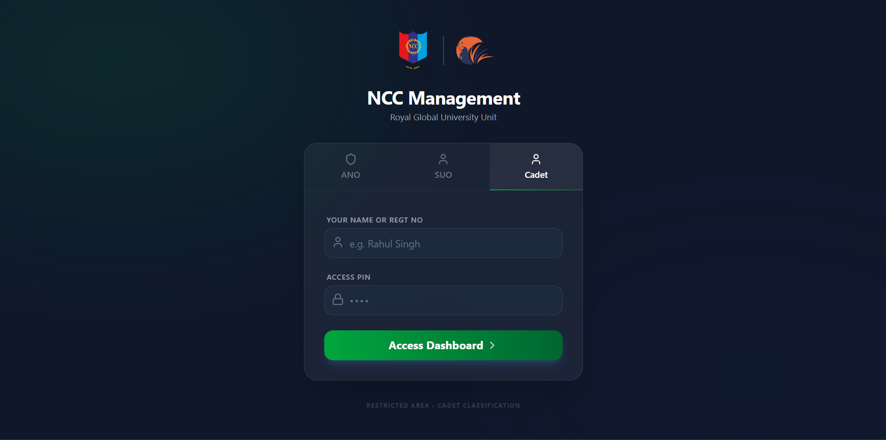
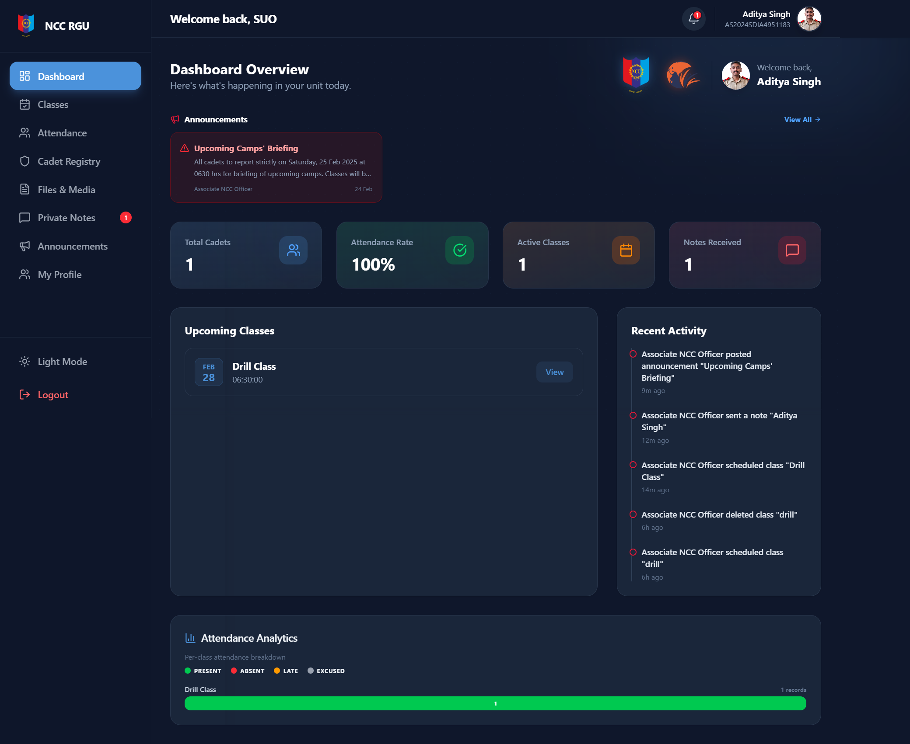
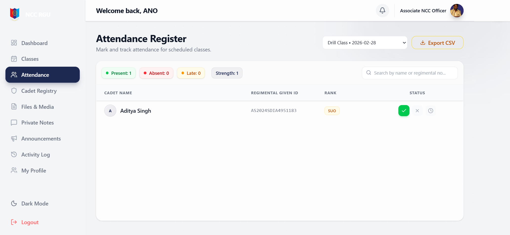
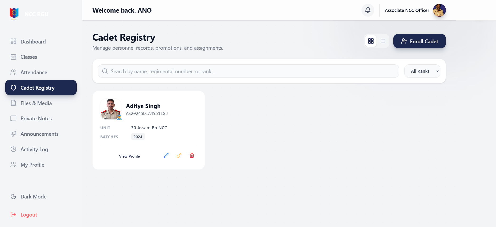
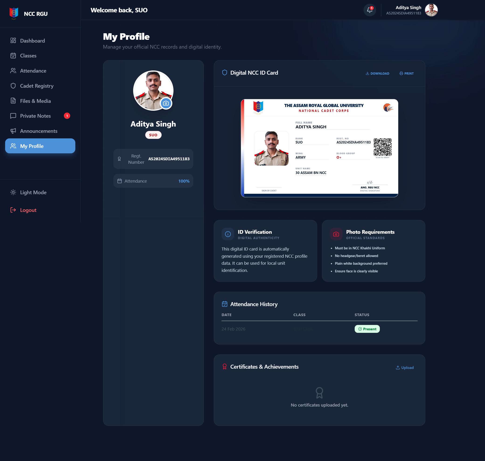
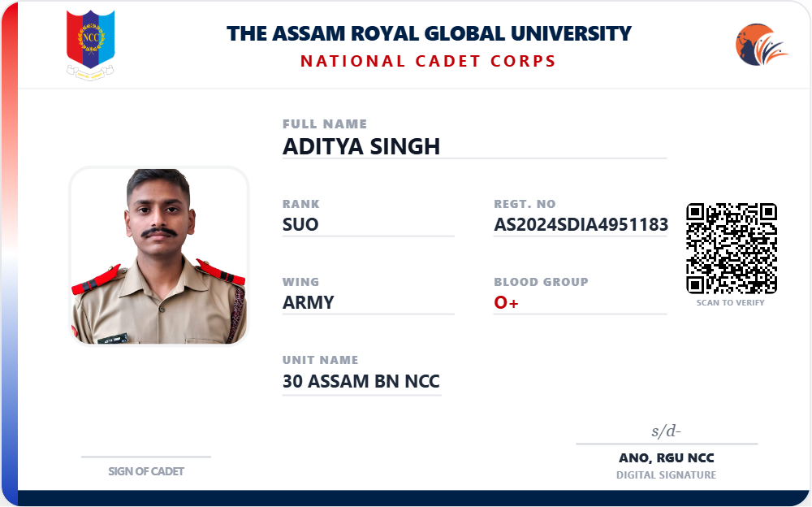
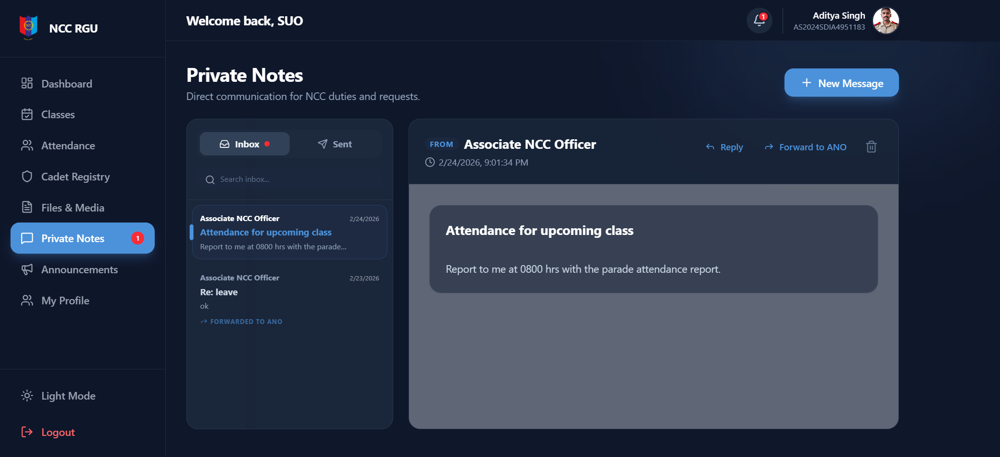

<p align="center">
  
  &nbsp;&nbsp;&nbsp;&nbsp;&nbsp;&nbsp;&nbsp;&nbsp;&nbsp;&nbsp;
  
</p>

# NCC RGU Cadet Management System

<p align="center">
  
  
  
  
</p>

A role-based Cadet Management System built with Next.js 15 and Supabase. Features real-time dashboards, QR verification, and administrative tools tailored for the National Cadet Corps.

## Tech Stack Overview
- **Framework**: [Next.js 16](https://nextjs.org/) (App Router, Server Actions for DB mutations)
- **Language**: [TypeScript](https://www.typescriptlang.org/) (Strict Mode enabled)
- **Database Backend**: [PostgreSQL](https://www.postgresql.org/) (Managed via Supabase)
- **Authentication**: Custom PIN-based server-side auth (Supabase backend)
- **Validation**: [Zod](https://zod.dev/) shared schemas for client + server
- **Styling**: [Tailwind CSS 4.0](https://tailwindcss.com/) with custom Glassmorphism/Dark Mode support
- **UI & Animations**: [Framer Motion](https://www.framer.com/motion/) for transitions, Shadcn UI base components
- **PWA & Offline**: Service Worker with cache-first strategy; IndexedDB-backed offline queueing for zero-connectivity areas.
- **Performance**: High-speed list virtualization via `@tanstack/react-virtual` for large datasets.
- **CI/CD**: GitHub Actions for automated linting and build verification.

## Application Walkthrough & Features

### 1. Secure Login & Authentication
> Custom PIN-based server-side authentication with strict role-based access control.


### 2. Comprehensive Dashboard
> Real-time statistics aggregation and asynchronous activity logging across the unit.


### 3. Attendance Management
> Batch status updates and relational database joins connecting cadets to training classes.


### 4. Cadet Registry
> Full text search, client-side filtering, and automated profile state hydration.


### 5. Personal Profiles
> Detailed views of cadet progression, ranks, and uploaded certificates.


### 6. Digital Identity (QR)
> High-resolution image snapshots with drop-shadows and rounded borders. Features a robust printing engine that bypasses mobile browser layout issues.


### 7. Secure Communications
> Hierarchical note passing with read-receipt real-time listeners between Cadets and Officers.


### 8. Offline Attendance Synchronization
> Robust queueing system that allows marking attendance in areas with no internet. Data is automatically synced to the server once connection is restored.

### 9. Alumni Lifecycle Management
> Systematic transition pipeline for graduating cadets, archiving their service history and performance scores without data loss.

## Core Modules Overview

| Module | Technical Features | Access Level |
| :--- | :--- | :--- |
| **Dashboard** | Real-time stats aggregation, async activity logging | ANO, SUO |
| **Registry** | Virtualized high-performance lists, multi-state (Active/Alumni) filtering | ANO, SUO, UO |
| **Digital ID** | Client-side QR generation, automated PDF extraction | All Ranks |
| **Attendance** | Offline-first queueing, relational DB joins, batch status updates | ANO, SUO, UO |
| **Vault** | Supabase Storage integration with expiring signed URLs for security | All Ranks |
| **Comms** | Hierarchical note passing, read-receipt real-time listeners | All Ranks |

## Role-Based Access Control (RLS)
Security is rigidly enforced at the PostgreSQL database level using Supabase Row Level Security (RLS). UI conditional rendering provides a fallback, but DB policies dictate true access.

| Role | Responsibility | System Privileges |
| :--- | :--- | :--- |
| **ANO** | Associate NCC Officer | SuperAdmin (Full DB bypass capabilities) |
| **SUO** | Senior Under Officer | Admin (Read/Write class, attendance, registry schemas) |
| **UO/SGT**| Junior Officers | Moderator (Write attendance, Read registry) |
| **Cadet** | Standard User | User (Read/Write personal `profiles`, read scoped `notes`) |

## File Architecture

A mental model of the source code for new contributors:

```text
├── public/                 # Static assets (logos, PWA manifest, service worker)
├── src/
│   ├── app/                # Next.js App Router root
│   │   ├── actions/        # Server Actions (Zod validated, role-guarded DB mutations)
│   │   ├── dashboard/      # Protected app routes (auth-guarded layout)
│   │   ├── verify/         # Public routes (QR identity verification)
│   │   └── page.tsx        # Auth gateway / Login component
│   ├── components/         # Shared React Components
│   │   ├── ui/             # Atomic design elements (buttons, inputs, modals)
│   │   ├── sidebar.tsx     # Role-aware navigation controller
│   │   └── topbar.tsx      # State-aware user header
│   ├── lib/                # Core Business Logic & Configurations
│   │   ├── auth-context.tsx  # Auth state, login/logout, session management
│   │   ├── data-context.tsx  # Global data fetching, realtime subscriptions
│   │   ├── toast-context.tsx # Centralized toast notification system
│   │   ├── schemas.ts        # Shared Zod schemas (client + server)
│   │   ├── server-auth.ts    # Server-side role guard (getCallerSession)
│   │   ├── supabase-client.ts# Browser-side Supabase client
│   │   └── supabase-admin.ts # Service-role client (bypasses RLS — server only)
│   └── types/              # Global TypeScript interfaces and Enums
├── supabase/
│   └── migrations/         # SQL migrations (schema, RLS policies, constraints)
├── package.json            # Dependencies and scripts
└── tailwind.config.ts      # Tailwind token definitions
```

## Quick Start (Local Development)

This guide assumes you have Node.js (v20+) and Git installed.

**1. Clone & Install Dependencies**
```bash
git clone https://github.com/CaptainCheetah978/RGU-NCC-Web-Application.git
cd RGU-NCC-Web-Application
npm install
```

**2. Configure Environment**
Create a `.env.local` file in the project root. You will need a Supabase project.
```env
# Required Supabase Keys (from your Supabase Project Settings)
NEXT_PUBLIC_SUPABASE_URL="https://your-project-id.supabase.co"
NEXT_PUBLIC_SUPABASE_ANON_KEY="your-anon-api-key"
SUPABASE_SERVICE_ROLE_KEY="your-service-role-key" # Never expose this to the client!

# Branding Variables (Allows you to white-label the app)
NEXT_PUBLIC_UNIT_NAME="NCC RGU"
NEXT_PUBLIC_INSTITUTION_NAME="Royal Global University"
```

**3. Initialize Database**
- Open your Supabase Dashboard.
- Navigate to the **SQL Editor**.
- Paste and execute the SQL files in `supabase/migrations/` (start with `supabase-policies.sql`, then `001_data_integrity.sql`).
- Navigate to **Storage** and create a bucket named `files` (set to Private). Add policies to allow authenticated CRUD operations.

**4. Run Development Server**
```bash
npm run dev
# App is ready at http://localhost:3000
```

## Multi-Unit Deployment
This repository is built to be unit-agnostic ("white-labeled"). To fork this for a different battalion or institution:
1. **Fork** the repository on GitHub.
2. Update the `NEXT_PUBLIC_*` branding variables in your deployment environment (e.g., Vercel).
3. Replace `public/ncc-logo.png` and `public/rgu-logo.png` with your respective unit vectors.
4. Ensure your Supabase backend is configured.

## Upcoming Roadmap
If you are planning to contribute, we are looking at:
- **Multilingual Support**: Abstracting strings for i18n routing (Hindi/Regional languages).
- **Camp Management**: High-volume parallel data ingestion logic.
- **Unit Tests**: Jest/Vitest + React Testing Library for Server Actions and components.
- **Analytics Dashboard**: Attendance trends, cadet performance scoring.
- **Export Features**: CSV/PDF attendance reports and cadet summaries.

## License & Primary Contact
Released under the [MIT License](LICENSE).

**Technical Lead:** [SUO Aditya Singh](https://github.com/CaptainCheetah978) 
**Unit:** 30 Assam Bn NCC, Guwahati Group, NER Directorate
